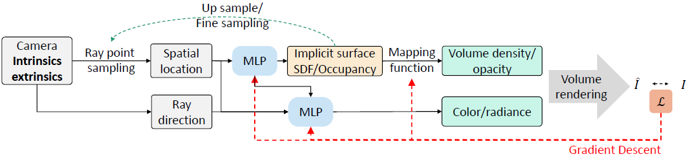
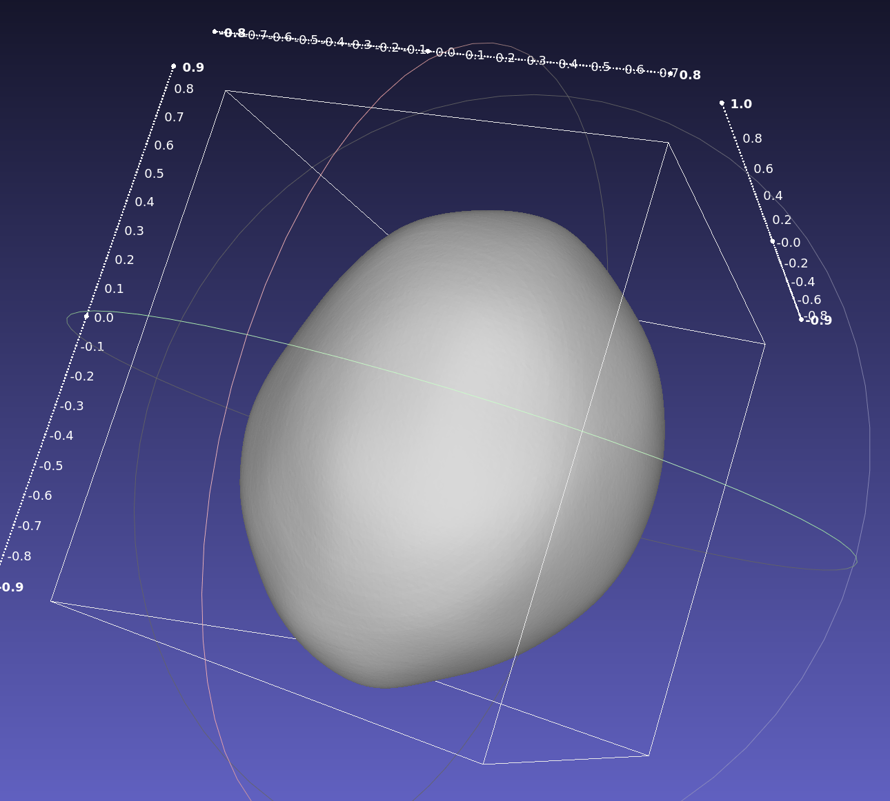
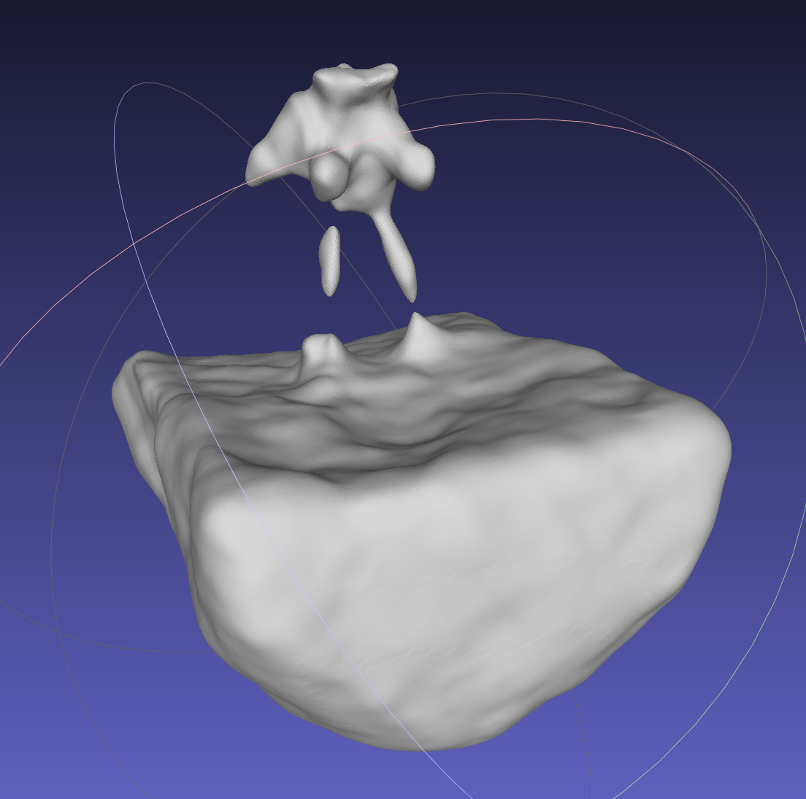
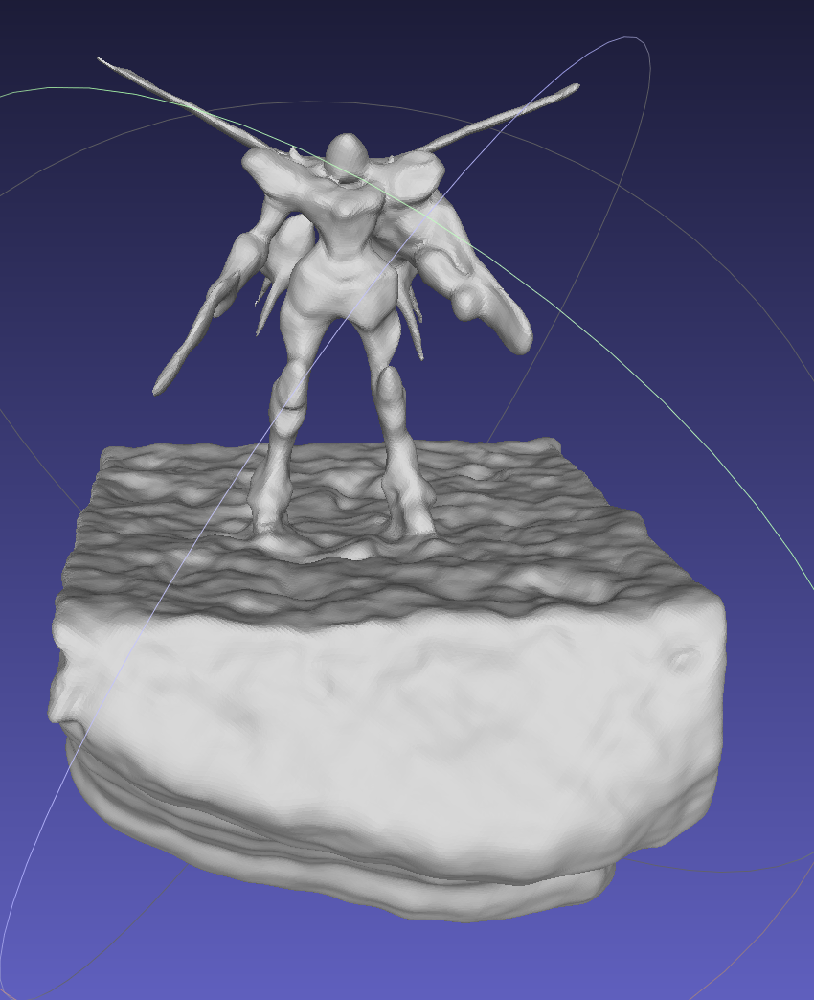
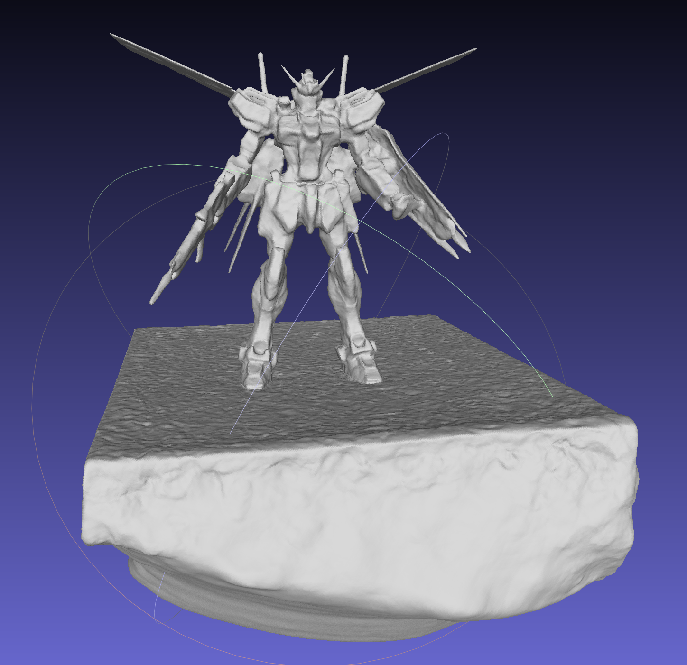
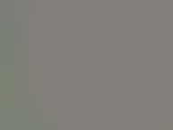
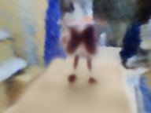
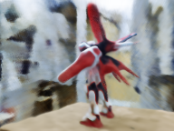
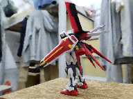
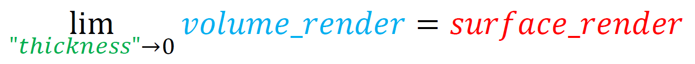

- [Volume rendering + 3D implicit surface](#volume-rendering--3d-implicit-surface)
- [Showcase](#showcase)
- [What?](#what)
    - [previous: surface rendering; now: volume rendering](#previous-surface-rendering-now-volume-rendering)
    - [previous: NeRF's volume density; now: implicit surface](#previous-nerfs-volume-density-now-implicit-surface)
  - [What's different of the implemented papers:](#whats-different-of-the-implemented-papers)
  - [Future](#future)
- [Results and trained models](#results-and-trained-models)
- [NOTES](#notes)
- [USAGE](#usage)
- [TODO](#todo)
- [CITATION](#citation)
- [Contact](#contact)
- [🎉🎉🎉 We are hiring!](#we-are-hiring)

## Volume rendering + 3D implicit surface = Neural 3D Reconstruction

Multi-view 3D reconstruction using neural rendering. 

### This repository holds :warning:unofficial:warning: pytorch implementations of: 

- **Unisurf: Unifying neural implicit surfaces and radiance fields for multi-view reconstruction**
    - [[preprint]](https://arxiv.org/abs/2104.10078) 

-  **NeuS: Learning neural implicit surfaces by volume rendering for multi-view reconstruction**
    - [[preprint]](https://arxiv.org/abs/2106.10689) [[official implementation]](https://github.com/Totoro97/NeuS)

- [VolSDF] **Volume rendering of neural implicit surfaces**
    - [[preprint]](https://arxiv.org/abs/2106.12052)

and more...

## Showcase

Trained with [VolSDF](https://arxiv.org/abs/2106.12052)@200k, with [NeRF++](https://github.com/Kai-46/nerfplusplus) as background.

- Above: :rocket: **<u>volume rendering</u>** of the scene (**<u>novel view synthesis</u>**)

- Below: extracted mesh from the learned implicit shape

|  |
| :----------------------------------------------------------: |
| full-res video: (35 MiB, 15s@576x768@30fps) [[click here]](https://longtimenohack.com/hosted/nerf-surface/volsdf_nerf%2B%2B_blended_norm_5c0d13_rgb%26mesh_576x768_450_archimedean_spiral.mp4) |


Trained with [NeuS](https://arxiv.org/abs/2106.10689) @300k, with [NeRF++](https://github.com/Kai-46/nerfplusplus) as background.

- Above: :rocket: **<u>volume rendering</u>** of the scene (**<u>novel view synthesis</u>**)
- Middle: extracted normals from the learned implicit shape ($\nabla_{\mathbf{x}} s$)
- Below: extracted mesh from the learned implicit shape

|  |  |  |
| ------------------------------------------------------------ | ------------------------------------------------------------ | ------------------------------------------------------------ |
|  |  |  |


## What?

The overall topic of the implemented papers is multi-view surface and appearance reconstruction **from pure posed images**. 

- studying and bridging between [[DeepSDF](https://arxiv.org/abs/1901.05103)/[OccupancyNet](https://arxiv.org/abs/1812.03828)]-like implicit 3D surfaces and volume rendering ([NeRF](https://www.matthewtancik.com/nerf)). 
- framework:



| What's known / Ground Truth / Supervision                    | What's learned                      |
| ------------------------------------------------------------ | ----------------------------------- |
| **ONLY** Multi-view **posed RGB images**. (no mask, no GT mesh, nothing.) | 3D surface / shape<br>3D appearance |

#### previous: surface rendering; now: volume rendering

From one perspective, the implemented papers introduce volume rendering to 3D implicit surfaces to differentiably render views and reconstructing scenes using photometric reconstruction loss. 

| Rendering methods in previous surface reconstruction approach | Rendering method in this repo (when training) |
| ------------------------------------------------------------ | --------------------------------------------- |
| Surface rendering                                            | Volume rendering                              |

The benefit of using volume rendering is that it diffuses gradients widely in space, and can efficiently learns a roughly correct shape at the very early beginning of training without mask supervision, avoiding bad local minimas when learning shapes, which is often encountered when using surface rendering even with mask supervision.

| config:<br> [[click me]](configs/volsdf_nerfpp_blended.yaml) | @0 iters                        | @3k iters<br>@16 mins           | @10k iters<br> @1 hours         | @200k iters<br>@ 18.5 hours       |
| ------------------------------------------------------------ | ------------------------------- | ------------------------------- | ------------------------------- | --------------------------------- |
| Extracted mesh from learned shape                            |    |    |  |  |
| Rendered view from learned appearance                        |  |  |  |    |


#### previous: NeRF's volume density; now: implicit surface

From another perspective, they change the original NeRF's shape representation (volume density $\sigma$) to a 3D implicit surface model, whose iso-surface is defined to represent spatial surfaces.

| Shape representation in NeRF | Shape representation in this repo                            |
| ---------------------------- | ------------------------------------------------------------ |
| Volume density               | [Occupancy net](https://arxiv.org/abs/1812.03828) (UNISURF) <br>[DeepSDF](https://arxiv.org/abs/1901.05103) (VolSDF/NeuS) |

The biggest disadvantage of NeRF's shape representation is that it considers objects volume clouds, which actually does not guarantees an exact surface, since there is no constraint on the learned density. 

Representing shapes with implicit surfaces can force the volume density to be associated with a exact surface. 

What's more, the association (or, the mapping function that maps implicit surface value to volume density) can be **controlled** either manually or by learn-able parameters, allowing the shape representation to be more surface-like or more volume-like, meeting different needs of different training stages.

|  |
| :----------------------------------------------------------: |
| Demonstration of controllable mappings from sdf value to volume density value. @VolSDF |

Hence, the training scheme can be roughly divided as follows (not discrete stages, continuously progressing instead):

- at the earlier stage of learning shapes, the shape representation is more volume-like, taking into account of the more neighboring points along the ray for rendering colors. The network fast learns a roughly correct shape and appearance.
- while in the later stage, the shape representation is more surface-like, almost only taking into account the exact intersected points of the ray with the surface. The network slowly learns the fine thin structures of shapes and fine details of appearance.

You can see that as the controlling parameter let narrower and narrower neighboring points being considered during volume rendering, the rendered results are almost equal to surface rendering. This is proved in [UNISURF](https://arxiv.org/abs/2104.10078), and also proved with results showed in the section [[docs/usage.md#use surface rendering instead of volume rendering]](docs/usage.md#pushpin-use-surface-rendering-instead-of-volume-rendering).




### What's different of the implemented papers:

- how to map a implicit surface value to a volume density representation, or how to (accurately) calculate volume rendering's opacity with such exact surface representation.
- how to efficiently sample points on camera rays taking advantage of the exact surface
- You can find out more on my [[personal notes]](https://longtimenohack.com/posts/nerf/nerf_on_surface/) (In Chinese only).


### Future

Currently, the biggest problem of methods contained in this repo is that the view-dependent reflection effect is **baked** into the object's surface, similar with [IDR](https://github.com/lioryariv/idr), [NeRF](https://www.matthewtancik.com/nerf) and so on. In other words, if you place the learned object into a new scene with different ambient light settings, the rendering process will have no consideration of the new scene's light condition, and keeps the ambient light's reflection of the old trained scene with it.

However, as the combination of implicit surface with NeRF has come true, ambient light and material decomposition can be easier for NeRF-based frameworks, since now shapes are represented by the underlying neural surface instead of volume densities.


## Results and trained models

The trained models are stored in [[GoogleDrive]](https://drive.google.com/drive/folders/1B7y-nMFO9noVI0byU34yPTRtqqzMdMIQ?usp=sharing) / [[Baidu, code: `reco`]](https://pan.baidu.com/s/10g1IWwrGrpE--VJ5XLuRFw).

For more visualization of the my trained results, see [[docs/trained_models_results.md]](docs/trained_models_results.md).


## USAGE

See [[docs/usage.md]](docs/usage.md) for detailed usage documentation.


## NOTES

- [[docs/neus.md]](docs/neus.md) Notes on the `unbiased` property of NeuS.
- [[docs/volsdf.md]](docs/volsdf.md) Notes on the `error bound` and `up sampline algorithm` of VolSDF.

- [[click here]](https://longtimenohack.com/posts/nerf/nerf_on_surface/) (in Chinese) My personal notes 我的个人笔记 


## TODO

- NeuS
  - [x] Compare with NeuS official repo. 
  - [x] Fix performance bug (camera inside surface after training) on some of the DTU instances.

- VolSDF
  - [ ] improve VolSDF's sampling performance
  - [ ] release more results
  
- UNISURF
  - [x] Fix performance bug (huge artifact after training) on some of the DTU instances.

- general
  - [ ] train camera
  - [x] cluster training configs
  - [x] DDP support
  - [x] refine GPU usage and try to allow for at least 2080 Ti.
  - [x] surface rendering option.
  - [ ] eval script for RGB
  - [ ] eval script for mesh CD


## CITATION

- UNISURF

```python
@article{oechsle2021unisurf,
  title={Unisurf: Unifying neural implicit surfaces and radiance fields for multi-view reconstruction},
  author={Oechsle, Michael and Peng, Songyou and Geiger, Andreas},
  journal={arXiv preprint arXiv:2104.10078},
  year={2021}
}
```

- NeuS

```python
@article{wang2021neus,
  title={NeuS: Learning Neural Implicit Surfaces by Volume Rendering for Multi-view Reconstruction},
  author={Wang, Peng and Liu, Lingjie and Liu, Yuan and Theobalt, Christian and Komura, Taku and Wang, Wenping},
  journal={arXiv preprint arXiv:2106.10689},
  year={2021}
}
```

- VolSDF

```python
@article{yariv2021volume,
  title={Volume Rendering of Neural Implicit Surfaces},
  author={Yariv, Lior and Gu, Jiatao and Kasten, Yoni and Lipman, Yaron},
  journal={arXiv preprint arXiv:2106.12052},
  year={2021}
}
```

- NeRF++

```python
@article{kaizhang2020,
    author    = {Kai Zhang and Gernot Riegler and Noah Snavely and Vladlen Koltun},
    title     = {NeRF++: Analyzing and Improving Neural Radiance Fields},
    journal   = {arXiv:2010.07492},
    year      = {2020},
}
```

- SIREN

```python
@inproceedings{sitzmann2019siren,
    author = {Sitzmann, Vincent and Martel, Julien N.P. and Bergman, Alexander W. and Lindell, David B. and Wetzstein, Gordon},
    title = {Implicit Neural Representations with Periodic Activation Functions},
    booktitle = {Proc. NeurIPS},
    year={2020}
}
```

## Acknowledgement

This repository modifies code or draw inspiration from:

- My another NeRF-- repo: https://github.com/ventusff/improved-nerfmm
- https://github.com/Totoro97/NeuS

- https://github.com/lioryariv/idr

- https://github.com/autonomousvision/differentiable_volumetric_rendering
- https://github.com/yenchenlin/nerf-pytorch
- https://github.com/YoYo000/MVSNet

- https://github.com/LMescheder/GAN_stability
- https://github.com/Kai-46/nerfplusplus


## Contact

If you have any problems, feel free to submit issues or contact Jianfei Guo(郭建非) `guojianfei [at] pjlab.org.cn`. PRs are also very welcome :smiley:.

## We are hiring! 

🎉🎉🎉

On behalf of Intelligent Transportation and Auto Driving Group in Shanghai AI Lab, we are hiring researcher/engineer/full-time intern for Computer Graphics and 3D Rendering Algorithm (base in Shanghai)

上海人工智能实验室智慧交通与自动驾驶团队招聘「图形学算法研究员」和「3D场景生成研究员」。实习、校招、社招均有海量HC。


### :sparkles: 图形学算法研究员
#### 岗位职责
1. 结合计算机图形学和深度学习进行研究，并探索相关技术在自动驾驶数据上的应用。
2. 研究基于神经渲染器、可微渲染等技术的高质量三维重建技术。
3. 研究面向数字孪生的城市场景重建技术。
4. 在图形学和计算机视觉领域跟踪学术和产业前沿方案，在单点算法上实现突破业界、原型验证，持续构建三维重建领域的技术竞争力。
5. 设计实现基于高质量三维重建数据嵌入的自动驾驶感知仿真平台，提升自动驾驶仿真数据在感知模型上的可用性。

#### 任职要求
1. 计算机科学与技术、电子工程、自动化、人工智能、应用数学、车辆工程等相关专业，本科及以上学历。
2. 有扎实的图形学基础，理解基本渲染管线，了解PBR光照、材质模型。
3. 熟悉机器学习与深度学习的基本理论，熟悉编程/脚本语言:C++/C/Python，至少使用过PyTorch、TensorFlow、Caffe等框架中的一种。
4. 加分项：熟悉并掌握一个或多个下列方向：神经网络隐式三维表示（如NeRF），场景三维重建，3D人体重建与生成
5. 加分项：理解渲染管线中的GPU编程原理，或具有GPU CUDA开发和性能优化经验
6. 加分项：有Unity, UE4等游戏引擎或Carla、AirSim等仿真项目的开发使用经验，或熟悉车辆、行人运动仿真
7. 加分项：有自动驾驶、计算机视觉和图像处理领域相关项目和研究背景。
8. 加分项：有相关领域顶级学术会议/期刊论文发表经历。

### :sparkles: 3D场景生成研究员

#### 岗位职责
1. 研究基于深度学习的生成模型在自动驾驶数据上的应用。
2. 研究利用GAN/VAE等生成学习技术针对自动驾驶感知场景数据生成算法。
3. 负责基于深度学习与生成模型算法进行自动驾驶感知数据仿真。
4. 负责跟踪学术界和工业界关于生成模型在计算机视觉、自动驾驶、智慧城市、数字孪生等领域的最新研究进展。
5. 设计实现基于生成模型的自动驾驶感知仿真平台，并利用生成数据提升下游感知任务的性能。

#### 任职要求
1. 计算机科学与技术、电子工程、自动化、人工智能、应用数学、车辆工程等相关专业，本科及以上学历。
2. 有扎实的深度学习基础，熟悉机器学习与深度学习的基本理论，并要求至少熟练掌握PyTorch、TensorFlow、Caffe等框架中的一种。
3. 代码能力强，有良好的C++/Python编码习惯，能够快速设计并执行实验、验证想法、具备能支持全栈开发工作的学习能力。
4. 加分项：有计算机图形学、立体视觉、三维重建、神经渲染、可微渲染等方向研究经历。
5. 加分项：熟悉并掌握一个或多个下列方向：3D生成模型，3D人体重建与生成，神经网络隐式三维表示（如NeRF）
6. 加分项：有自动驾驶领域相关项目和研究背景。
7. 加分项：在相关领域有顶级学术会议/期刊论文发表经历。

----

**对以上两个岗位感兴趣的同学请发送简历到 `shibotian [at] pjlab.org.cn`, `guojianfei [at] pjlab.org.cn`。标题务必包含「应聘」两个字，谢谢。**

---

### About Shanghai AI Lab/关于上海人工智能实验室

上海人工智能实验室是中国人工智能领域的新型科研机构，由汤晓鸥、姚期智、陈杰等多位世界人工智能领域知名学者领衔发起成立，于2020年7月在世界人工智能大会正式揭牌。

实验室研究团队由一流科学家和团队按新机制组建。并开展战略性、原创性、前瞻性的科学研究与技术攻关，突破人工智能的重要基础理论和关键核心技术，打造“突破型、引领型、平台型”一体化的大型综合性研究基地，支撑中国人工智能产业实现跨越式发展，目标建成国际一流的人工智能实验室，成为享誉全球的人工智能原创理论和技术的策源地。

实验室先后与上海交通大学、复旦大学、浙江大学、中国科学技术大学、香港中文大学、同济大学、华东师范大学等知名高校签订战略合作协议，建立科研人员双聘和职称互认机制，汇聚国内国际优势资源，探索建立创新型的评价考核制度和具有国际竞争力的薪酬体系及条件保障。

上海人工智能实验室官方网站：[https://www.shlab.org.cn/](https://www.shlab.org.cn/)

智能交通与自动驾驶研发岗位招聘：[https://www.shlab.org.cn/news/5443060](https://www.shlab.org.cn/news/5443060)
