## Results

### DTU dataset

<table class="tg">
<thead>
  <tr>
    <th class="tg-0lax" rowspan="2">SCAN_ID</th>
    <th class="tg-0lax" rowspan="2">reference image</th>
      <th class="tg-0lax" colspan="3"><strong>rendered</strong> views &amp; learned shape  (above: novel view synthesis &amp; below: 3D reconstruction)</th>
  </tr>
  <tr>
    <th class="tg-0lax">UNISURF</th>
    <th class="tg-0lax">NeuS (NeRF++ background)</th>
    <th class="tg-0lax">VolSDF</th>
  </tr>
</thead>
<tbody>
  <tr>
    <td class="tg-0lax">24</td>
    <td class="tg-0lax"></td>
    <td class="tg-0lax"></td>
    <td class="tg-0lax"></td>
    <td class="tg-0lax"></td>
  </tr>
  <tr>
    <td class="tg-0lax">37</td>
    <td class="tg-0lax">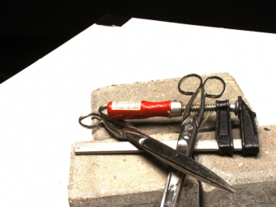</td>
    <td class="tg-0lax"></td>
    <td class="tg-0lax"></td>
    <td class="tg-0lax"></td>
  </tr>
  <tr>
    <td class="tg-0lax">40</td>
    <td class="tg-0lax">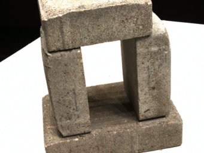</td>
    <td class="tg-0lax"></td>
    <td class="tg-0lax"></td>
    <td class="tg-0lax"></td>
  </tr>
  <tr>
    <td class="tg-0lax">55</td>
    <td class="tg-0lax">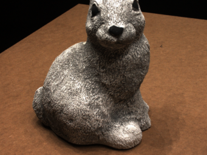</td>
    <td class="tg-0lax"></td>
    <td class="tg-0lax"></td>
    <td class="tg-0lax"></td>
  </tr>
  <tr>
    <td class="tg-0lax">63</td>
    <td class="tg-0lax">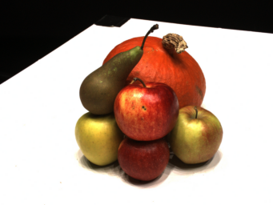</td>
    <td class="tg-0lax"></td>
    <td class="tg-0lax"></td>
    <td class="tg-0lax"></td>
  </tr>
  <tr>
    <td class="tg-0lax">65</td>
    <td class="tg-0lax">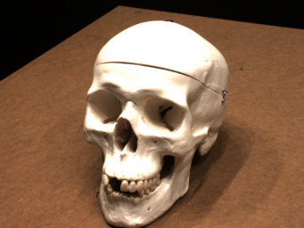</td>
    <td class="tg-0lax"></td>
    <td class="tg-0lax"></td>
    <td class="tg-0lax"></td>
  </tr>
  <tr>
    <td class="tg-0lax">69</td>
    <td class="tg-0lax">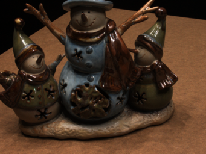</td>
    <td class="tg-0lax"></td>
    <td class="tg-0lax"></td>
    <td class="tg-0lax"></td>
  </tr>
  <tr>
    <td class="tg-0lax">83</td>
    <td class="tg-0lax">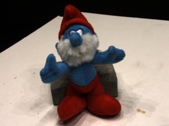</td>
    <td class="tg-0lax"></td>
    <td class="tg-0lax"></td>
    <td class="tg-0lax"></td>
  </tr>
  <tr>
    <td class="tg-0lax">97</td>
    <td class="tg-0lax">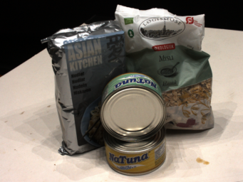</td>
    <td class="tg-0lax"></td>
    <td class="tg-0lax"></td>
    <td class="tg-0lax"></td>
  </tr>
  <tr>
    <td class="tg-0lax">105</td>
    <td class="tg-0lax">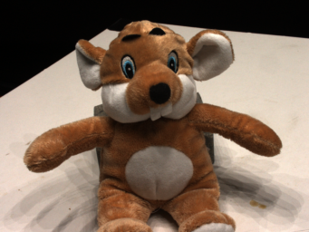</td>
    <td class="tg-0lax"></td>
    <td class="tg-0lax"></td>
    <td class="tg-0lax"></td>
  </tr>
  <tr>
    <td class="tg-0lax">106</td>
    <td class="tg-0lax">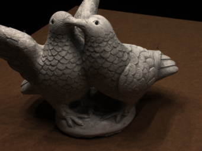</td>
    <td class="tg-0lax"></td>
    <td class="tg-0lax"></td>
    <td class="tg-0lax"></td>
  </tr>
  <tr>
    <td class="tg-0lax">110</td>
    <td class="tg-0lax">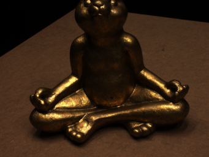</td>
    <td class="tg-0lax"></td>
    <td class="tg-0lax"></td>
    <td class="tg-0lax"></td>
  </tr>
  <tr>
    <td class="tg-0lax">114</td>
    <td class="tg-0lax">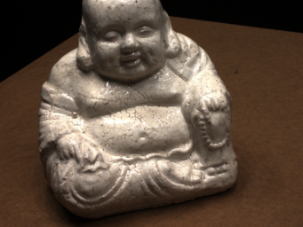</td>
    <td class="tg-0lax"></td>
    <td class="tg-0lax"></td>
    <td class="tg-0lax"></td>
  </tr>
  <tr>
    <td class="tg-0lax">118</td>
    <td class="tg-0lax">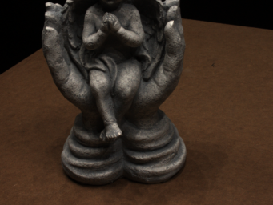</td>
    <td class="tg-0lax"></td>
    <td class="tg-0lax"></td>
    <td class="tg-0lax"></td>
  </tr>
  <tr>
    <td class="tg-0lax">122</td>
    <td class="tg-0lax">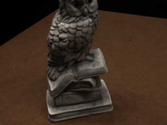</td>
    <td class="tg-0lax"></td>
    <td class="tg-0lax"></td>
    <td class="tg-0lax"></td>
  </tr>
</tbody>
</table>

### BlendedMVS dataset

<table class="tg">
<thead>
  <tr>
    <th class="tg-0lax" rowspan="2">ID</th>
    <th class="tg-0lax" rowspan="2">reference image</th>
    <th class="tg-0lax" colspan="3">learned shape &amp; rendered views (3D reconstruction &amp; novel view synthesis)</th>
  </tr>
  <tr>
    <th class="tg-0lax">UNISURF</th>
    <th class="tg-0lax">NeuS</th>
    <th class="tg-0lax">VolSDF</th>
  </tr>
</thead>
<tbody>
  <tr>
    <td class="tg-0lax">5c0d13b795da9479e12e2ee9</td>
    <td class="tg-0lax"></td>
    <td class="tg-0lax"></td>
    <td class="tg-0lax"></td>
    <td class="tg-0lax">figure</td>
  </tr>
</tbody>
</table>