# Notes on the up-sampling algorithm and error bound of VolSDF

In VolSDF, they prove a error bound of the discontinuous Riemann Sum's approximations in the opacity's calculation, and derive a ray point up-sampling algorithm to control the error bound to keep smaller than manually set  `episilon`, which is set to `0.1`.

## 1. up sampling algorithm's visualization in tensorboard when training

|                                      | @0k                                                          | @4k                                                          | @10k                                                         | @200k                                                        |
| ------------------------------------ | ------------------------------------------------------------ | ------------------------------------------------------------ | ------------------------------------------------------------ | ------------------------------------------------------------ |
| up sample iterations until converged | 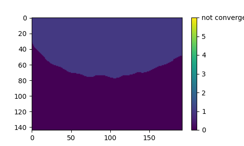 | 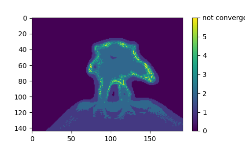 | 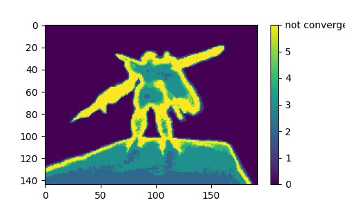 | 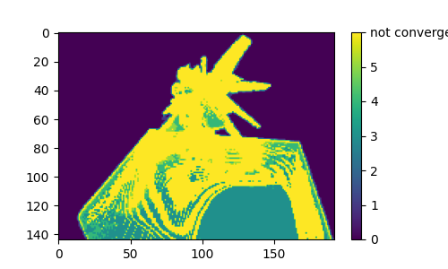 |
| beta heat map                        | 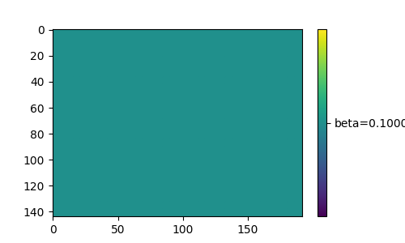   | 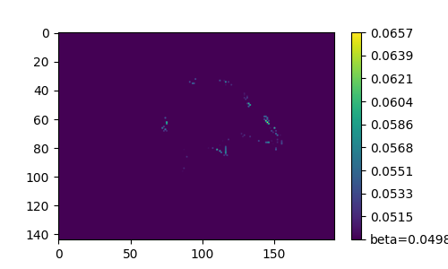   | 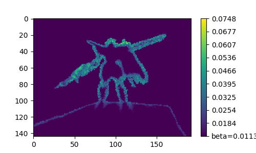   | 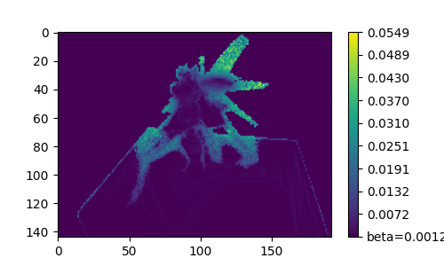   |


## 2. up sampling algorithm single ray testing

- network's beta = 0.001
- eps = 0.1
- To try it yourself, run:

```shell
python -m debug_tools.test_volsdf_algo
```


### 0-th iteration

- 128 uniform sample points.
- If use the network's `beta`, then `error_bound.max`=inf, which does not satisfy `<eps=0.1`.
- for `beta+`=0.431, the plots are

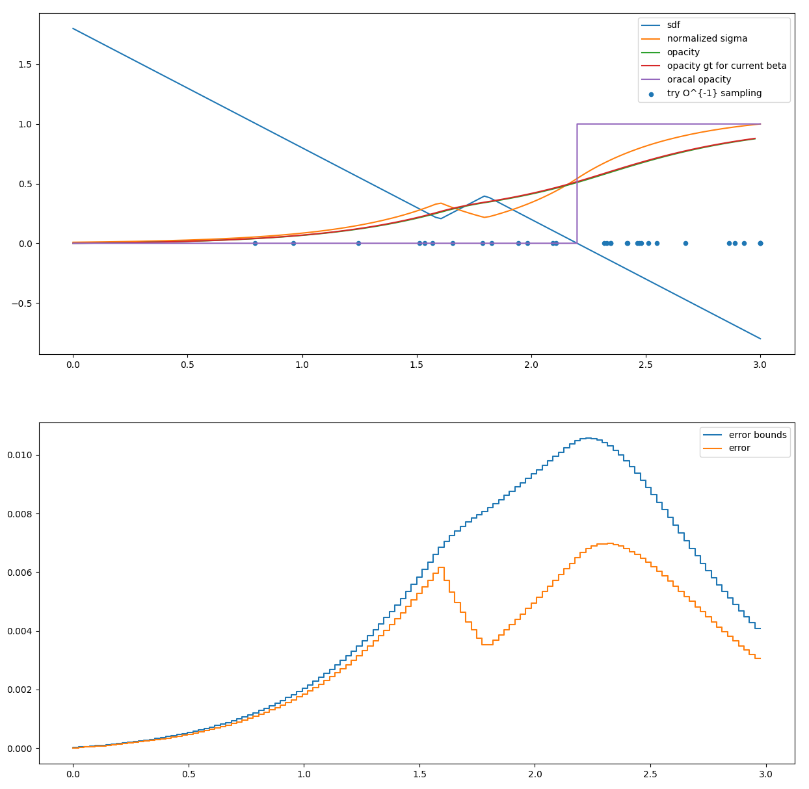

### 1-st iteration

- 256 sampling points.
- If use the network's `beta`, then `error_bound.max`=inf, which does not satisfy `<eps=0.1`.
- for `beta+`=0.049, the plots are

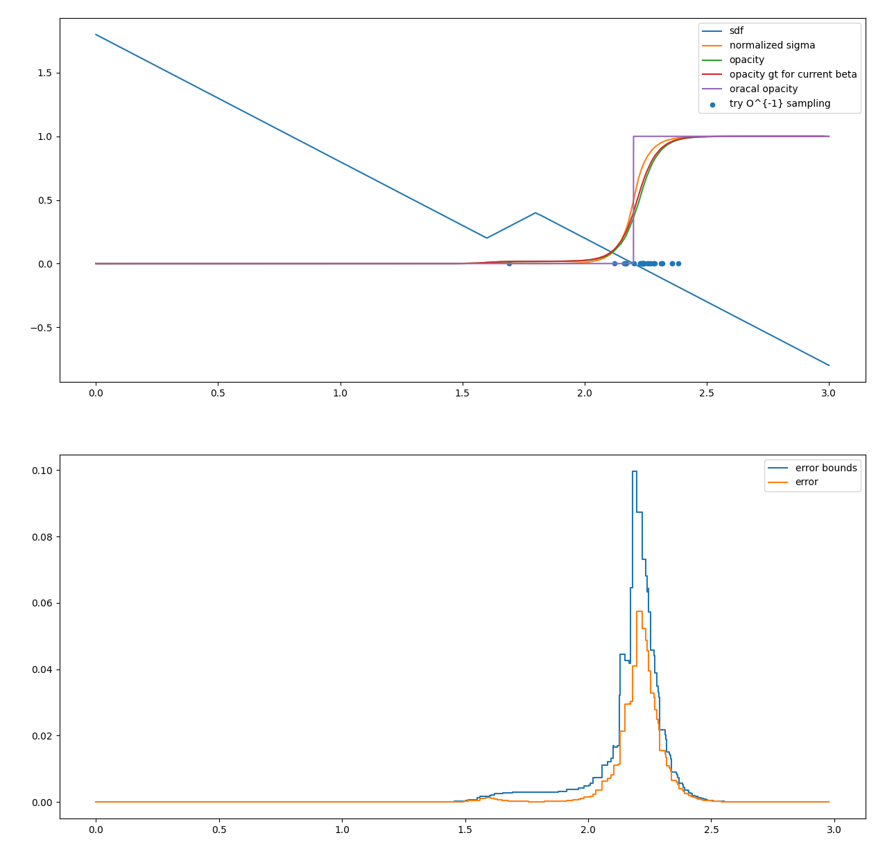

### 2-nd iteration

- 384 sampling points
- If use the network's `beta`, then `error_bound.max = 1.3e5`, which does not satisfy `<eps=0.1`.
- for `beta+`=0.023, the plots are

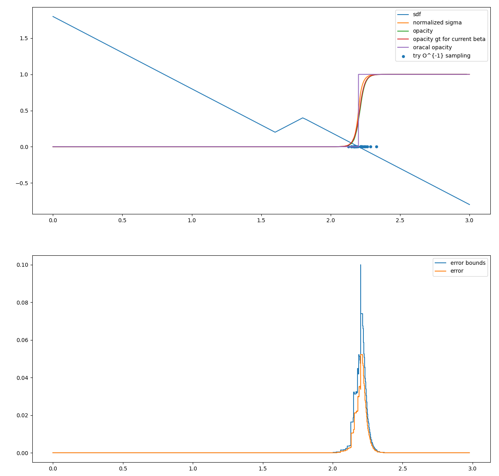

### 3-rd iteraion

- 512 sampling points
- If use the network's `beta`, then `error_bound.max = 0.570`, which does not satisfy `<eps=0.1`.
- for `beta+`=0.013, the plots are

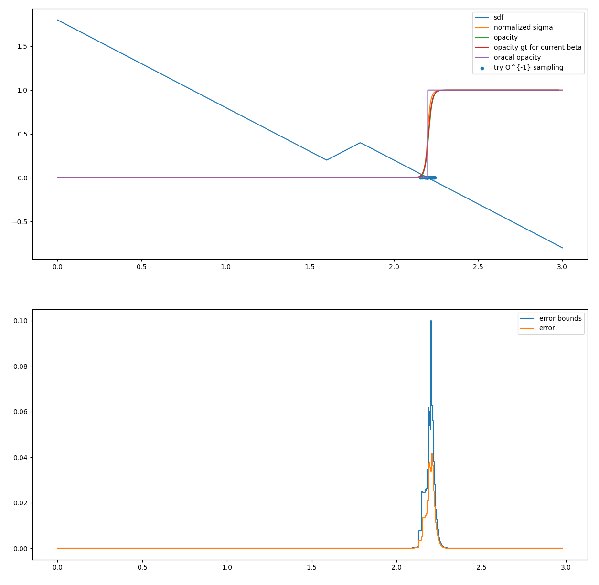

### 4-th iteration

- 640 sampling points
- If use the network's `beta`, then `error_bound.max = 0.116`, which does not satisfy `<eps=0.1`.
- for `beta+`=0.001, the plots are

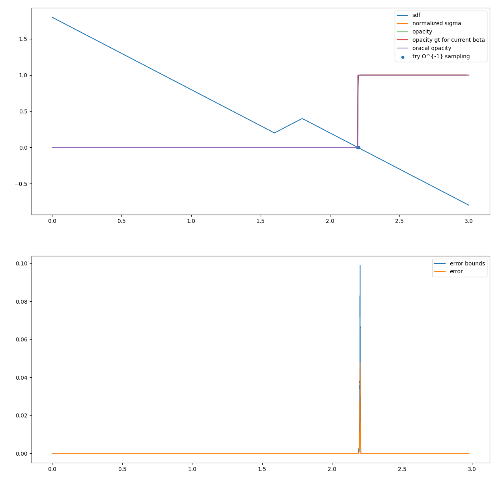

### 5-th iteration

- 768 sampling points
- If use the network's `beta`, then `error_bound.max = 0.0220`, which **satisfies** `<eps=0.1`. The plots are:

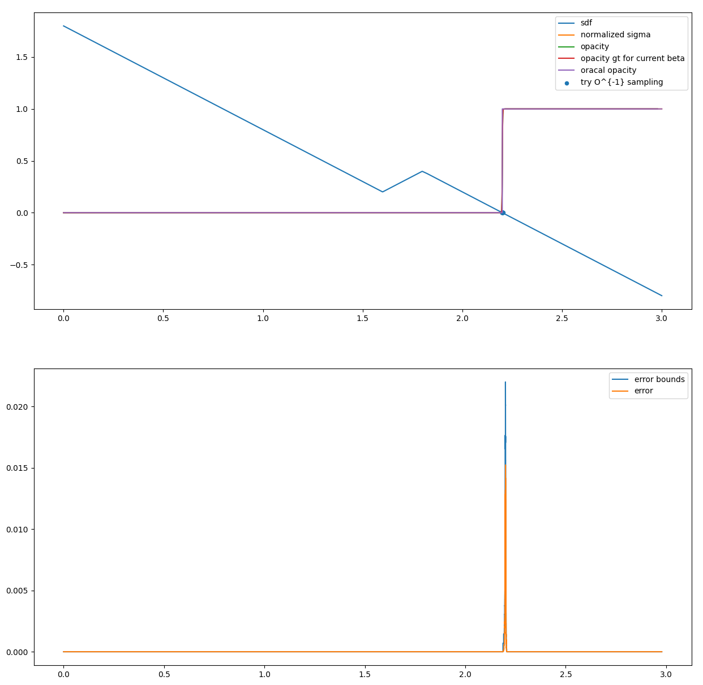